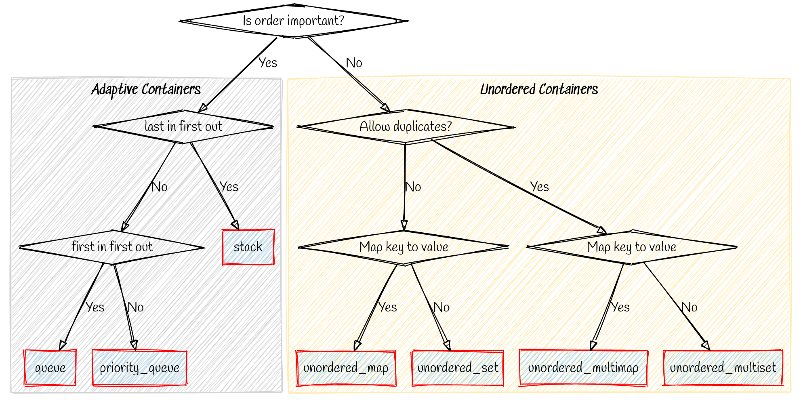

# C++ STL (Standard Template Library)

>The `Standard Template Library (STL)` is a software library for the C++ programming language that influenced many parts of the C++ Standard Library. It provides four components called `algorithms`, `containers`, `functions`, and `iterators`.

---

### C++ Standard Library

* Input/output or Iterators
* Strings
* algorithm
* functional

### Containers

* Sequence containers
* Associative containers
* Unordered associative containers

---

## STL - parts

STL has four components

* Algorithms
* Containers
* Functions
* Iterators

## Which container to use?

## Some articles to read

* [GeeksForGeeks](https://www.geeksforgeeks.org/the-c-standard-template-library-stl/)

## Resources used

* [Sketchviz](https://sketchviz.com/new) - for making graphs